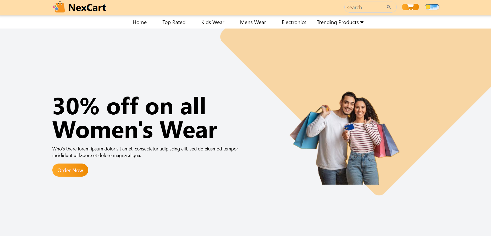

# 🛍️ NexCart — Modern E-Commerce Website

<div align="center">

### A modern, responsive e-commerce frontend built with React, Tailwind CSS & Vite.

[](https://ecommerce-web-liart.vercel.app)
[](https://github.com/Omkar-Nirgude/Ecommerce_web)
[](https://react.dev/)
[](https://vite.dev/)
[](https://tailwindcss.com/)

</div>

---

## 📌 Overview

**NexCart** is a responsive e-commerce website frontend designed to provide a clean and engaging online shopping experience.

The project focuses on building a reusable React component architecture, responsive layouts, interactive UI elements, dark mode, animations, product sections, and a polished shopping interface.

🔗 **Live Demo:** https://ecommerce-web-liart.vercel.app

---

## ✨ Key Features

- 🛒 **E-Commerce Shopping Interface**
- 📱 **Responsive Design** for desktop, tablet, and mobile
- 🌙 **Dark Mode** with theme persistence
- 🔍 **Search UI**
- 🛍️ **Order Now Popup**
- 🔥 **Trending Products Dropdown**
- ⭐ **Top Rated Products Section**
- 💰 **Promotional / Sale Banner**
- 💬 **Testimonials Section**
- 📧 **Newsletter / Subscribe Section**
- 🎠 **Product & Content Sliders**
- ✨ **AOS Scroll Animations**
- 🎨 **Modern UI using Tailwind CSS**
- 🧩 **Reusable React Components**
- 🚀 **Production deployment with Vercel**

---

## 🖥️ Preview

> Add a screenshot of your homepage as `preview.png` in the repository root.



---

## 🛠️ Tech Stack

| Technology | Purpose |
|---|---|
| **React.js** | Building the user interface |
| **JavaScript** | Application logic and interactivity |
| **Tailwind CSS** | Responsive styling and UI design |
| **Vite** | Development server and production build |
| **React Icons** | UI icons |
| **Swiper** | Sliders and interactive content |
| **AOS** | Scroll-based animations |
| **Git & GitHub** | Version control |
| **Vercel** | Deployment |

---

## 🧩 Component Architecture

The application is divided into reusable React components:

```text
src/
├── assets/
│
├── components/
│   ├── Banner/
│   ├── Footer/
│   ├── Hero/
│   ├── Navbar/
│   ├── Popup/
│   ├── Product/
│   ├── Subscribe/
│   ├── Testimonials/
│   └── TopProduct/
│
├── App.jsx
├── main.jsx
└── index.css
```

This component-based structure makes the project easier to maintain, reuse, and extend.

---

## 🎯 Highlights of the Implementation

### 🌙 Dark Mode

NexCart includes a dark mode interface designed to provide a better viewing experience across different lighting conditions.

### 📱 Responsive Layout

The UI is built with responsive Tailwind CSS utilities so the layout adapts to different screen sizes.

### 🛍️ Order Popup

The **Order Now** interaction uses React state to open and close a reusable popup component.

### 🔽 Interactive Navigation

The navigation bar includes menu items and a **Trending Products** dropdown with hover interaction.

### ✨ Animations

AOS is used to add smooth scroll-based animations to selected sections of the website.

---

## 🚀 Getting Started

### 1. Clone the repository

```bash
git clone https://github.com/Omkar-Nirgude/Ecommerce_web.git
```

### 2. Navigate to the project

```bash
cd Ecommerce_web/Ecommerce_web
```

### 3. Install dependencies

```bash
npm install
```

### 4. Start the development server

```bash
npm run dev
```

Vite will provide a local development URL in the terminal.

---

## 🏗️ Production Build

Create an optimized production build:

```bash
npm run build
```

Preview the production build locally:

```bash
npm run preview
```

---

## 📂 Project Structure

```text
Ecommerce_web/
│
└── Ecommerce_web/
    │
    ├── public/
    ├── src/
    │   ├── assets/
    │   ├── components/
    │   │   ├── Banner/
    │   │   ├── Footer/
    │   │   ├── Hero/
    │   │   ├── Navbar/
    │   │   ├── Popup/
    │   │   ├── Product/
    │   │   ├── Subscribe/
    │   │   ├── Testimonials/
    │   │   └── TopProduct/
    │   │
    │   ├── App.jsx
    │   ├── main.jsx
    │   └── index.css
    │
    ├── index.html
    ├── package.json
    ├── package-lock.json
    └── vite.config.js
```

---

## 📚 What I Learned

Building NexCart helped me strengthen my understanding of:

- React component-based architecture
- React Hooks and state management
- Props and component communication
- Responsive web design
- Tailwind CSS utility classes
- Dark mode implementation
- Interactive dropdowns and popups
- Third-party React libraries
- Git and GitHub workflows
- Production builds with Vite
- Deploying frontend applications with Vercel
- Debugging deployment and dependency issues

---

## 🔮 Future Improvements

Planned improvements for NexCart include:

- [ ] Product details pages
- [ ] Shopping cart functionality
- [ ] User authentication
- [ ] Backend API integration
- [ ] Database integration
- [ ] Product filtering and sorting
- [ ] Search functionality
- [ ] Checkout flow
- [ ] Order management
- [ ] Payment gateway integration

---

## 👨‍💻 Author

### Omkar Nirgude

Aspiring Full Stack Developer focused on building modern, responsive web applications.

- 🌐 **Live Project:** https://ecommerce-web-liart.vercel.app
- 💻 **GitHub:** https://github.com/Omkar-Nirgude

---

## ⭐ Support

If you found this project useful or interesting, consider giving the repository a ⭐ on GitHub.

---

<div align="center">

### 🛍️ NexCart

**Built with React ❤️ and a focus on clean, responsive UI.**

</div>
